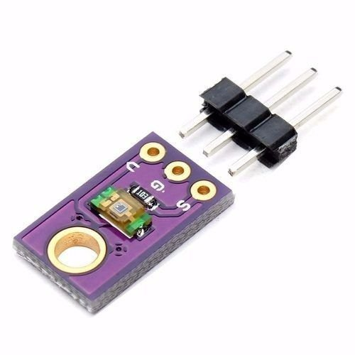

# Sensores e suas características

Abaixo se encontra o modelo do sensor e algumas características

## TEMT6000

### Sensor de Intensidade de Luz

**Retorno:** Intensidade de Luz

#### Ligação no Arduino

| **Pino** | **Porta** |
| :------- | :-------- |
| V        | A0        |
| G        | A1        |
| S        | A2        |

|Especificação|**Max**| **Miliampère (mA)  **|
|-------------|-------|----------------------|
|Collector dark current |50 nA|0,00005 mA|
|Collector Light Current|16 μA|0,016 mA|

